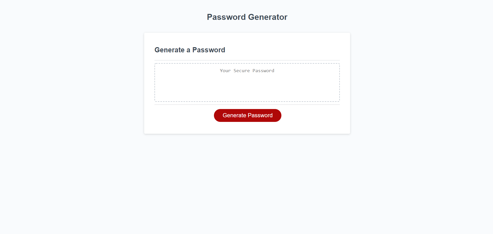
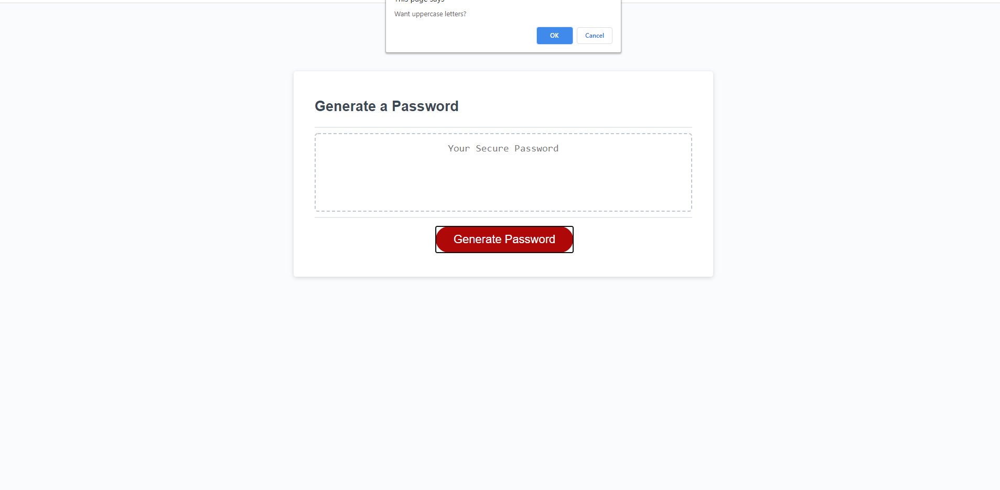

# 
Password-Generator
 

## 
Description
 

This is the homework for week three. The main objective is to create a random password generator with prompts. The prompts will request information that will influence the generator to come up with a more unique password for stronger security. This information will be inputs based on the user's preferences. After all prompts are satisfied, a random password will be generated and displayed on the page.

## 
Screenshots
 

## 
Links
 

* https://github.com/LostandConfusedStudent/Password-Generator
* https://lostandconfusedstudent.github.io/Password-Generator